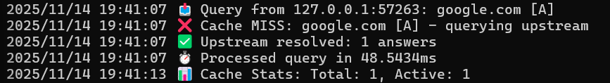
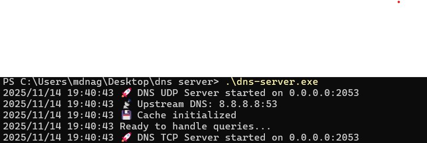
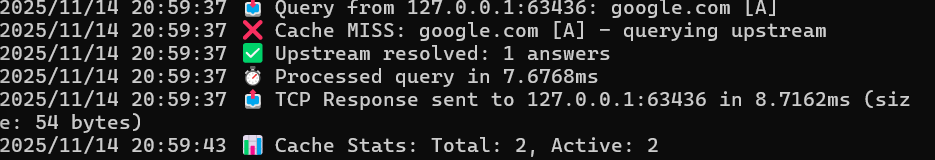
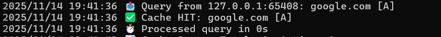
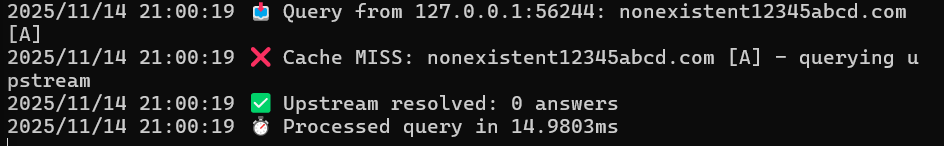

# **DNS Server**

A minimal, educational DNS resolver written entirely from scratch in **Go**, implementing core DNS protocol features such as packet parsing, record decoding, caching, and upstream resolution over UDP/TCP.

This project is designed to demonstrate understanding of **network protocols**, **binary encoding/decoding**, **UDP servers**, **TCP DNS framing**, and **DNS message construction**.

---

## **Table of Contents**

1. [Overview](#overview)
2. [Features](#features)
3. [How DNS Works (Short Explanation)](#how-dns-works)
4. [Project Architecture](#project-architecture)
5. [Core Components](#core-components)
6. [How Resolution Works in This Server](#how-resolution-works)
7. [Build & Run Instructions](#build--run-instructions)
8. [Querying the Server (Demo)](#querying-the-server-demo)
9. [Screenshots](#screenshots)
10. [Project Limitations](#limitations)
11. [Future Improvements](#future-improvements)

---

## **Overview**

This is a fully functional **DNS forwarder (recursive resolver)** that listens on port **2053** and handles DNS queries by:

1. Parsing incoming DNS packets (UDP or TCP)
2. Checking an in-memory cache
3. Forwarding unresolved queries to an upstream DNS server (Google DNS: `8.8.8.8`)
4. Parsing upstream responses
5. Returning properly constructed DNS responses to the client

The goal of the project is to **show the inner workings of DNS** by implementing low-level packet parsing, encoding, caching, and networking without using any DNS libraries.

---

## **Features**

* Fully manual DNS packet parsing and serialization
* Supports:

  * A, AAAA, MX, NS, CNAME and other record types
  * UDP and TCP queries (RFC-compliant length prefix for TCP)
* Basic recursive resolver (forwards to upstream)
* Full in-memory caching with TTL
* Proper DNS header flag handling
* Clean logs:

  * cache hit / miss
  * upstream lookup latency
  * full request tracing
* Pure Go implementation (no external dependencies)

---

## **How DNS Works**

A DNS lookup resolves a hostname (e.g., `google.com`) to an IP.

High-level workflow:

1. Client sends a DNS query (UDP/TCP, typically port 53)
2. Resolver forwards request to upstream DNS (recursive resolution)
3. Upstream returns:

   * answer section (A, AAAA, etc.)
   * authority section
   * additional section
4. Resolver caches the records using TTL
5. Subsequent queries for the same record are served **instantly** from cache

This server reproduces the above workflow in minimal, inspectable Go code.

---

## **Project Architecture**

```
dns_server/
│
├── dns_main.go       → server entrypoint, UDP & TCP listeners
├── dns_tcp.go        → TCP DNS framing + request handling
├── dns_buffer.go     → byte-level read/write utilities
├── dns_header.go     → DNS header parsing and encoding
├── dns_packet.go     → high-level DNS packet structure
├── dns_record.go     → DNS record decoding/encoding
├── dns_question.go   → DNS question format
├── dns_resolver.go   → upstream DNS recursion logic
├── dns_cache.go      → in-memory TTL-based cache
│
└── go.mod
```

The architecture mirrors the actual DNS protocol layout:

* **Buffer** → raw byte access
* **Header** → DNS flags (QR, RD, RA, OPCODE, RCODE, etc.)
* **Question** → domain + query type
* **Record** → parsed answers
* **Packet** → full DNS message
* **Server** → networking & orchestration

---

## **Core Components**

### **1. BytePacketBuffer**

Handles reading/writing DNS binary data:

* reading domain names with pointer compression (RFC 1035)
* reading various integer sizes
* writing query names
* ensuring bounds safety

### **2. DnsPacket**

High-level representation of:

* Header
* Questions
* Answers
* Authorities
* Additional records

Handles:

* `ToBytes()` → serialization
* `FromBytes()` → parsing inbound packets

### **3. DnsResolver**

Forwards queries to upstream DNS (`8.8.8.8:53`):

* builds a minimal query packet
* sends via UDP
* parses the upstream response
* returns answer/authority/additional sections

Timeouts are handled cleanly.

### **4. Cache**

TTL-based:

* cache per (name, type)
* respects TTL returned by upstream
* periodic stats logs

### **5. Server**

Implements:

* UDP listener → read packet → parse → respond
* TCP listener → RFC-compliant 2-byte length prefix → parse → respond

Response logic is shared for both transports.

---

## **How Resolution Works in This Server**

```
Client Query  →  Server → Check Cache
                    ↓
              Cache Hit? → Yes → return immediately
                    ↓
                 No → Forward to 8.8.8.8
                    ↓
              Upstream Response Arrives
                    ↓
            Parse & Cache Records (TTL)
                    ↓
        Build Response Packet & Return to Client
```

---

## **Build & Run Instructions**

### **Prerequisites**

* Go 1.20+
* (Optional) dig tool (BIND utilities)

Install dig on Windows:

```
winget install ISC.Bind
```

---

### **1. Build the server**

```
go mod tidy
go build -o dns-server.exe .
```

### **2. Run the server**

```
.\dns-server.exe
```

You should see:

```
DNS UDP Server started on 0.0.0.0:2053
DNS TCP Server started on 0.0.0.0:2053
Ready to handle queries...
```

---

## **Querying the Server (Demo)**

### **A record (UDP)**

```
dig @127.0.0.1 -p 2053 google.com A
```

### **MX record**

```
dig @127.0.0.1 -p 2053 google.com MX
```

### **NS record**

```
dig @127.0.0.1 -p 2053 google.com NS
```

### **TCP DNS query**

```
dig @127.0.0.1 -p 2053 google.com +tcp
```

### **Nonexistent domain**

```
dig @127.0.0.1 -p 2053 nonexistent12345abcd.com A
```

---

## **Screenshots**

*(Below are the outputs for various queries:)*

```
assets/
│── server-startup.png
│── udp-query.png
│── tcp-query.png
│── cache-hit.png
│── nxdomain.png

```

Example:

```






```

---

## **Limitations**

* No iterative resolution (relies on 8.8.8.8)
* No zone file support
* No DNSSEC
* No EDNS0 / larger UDP packets
* Minimal TCP hardening
* No concurrency limits

---

## **Future Improvements**

* Implement full iterative DNS resolver
* Add support for:

  * DNSSEC
  * EDNS0
  * DNS over TLS / HTTPS
* Add LRU cache
* Add configurable upstreams
* Add metrics (Prometheus)
* Add unit tests for all record types

---

# **This README is ready to be added to your GitHub repo.**

If you want, I can now:

✅ Write documentation PDF
✅ Create architecture diagrams as images
✅ Add inline code documentation
✅ Polish the repo for interview
✅ Prepare your interview explanation script

Just tell me.
